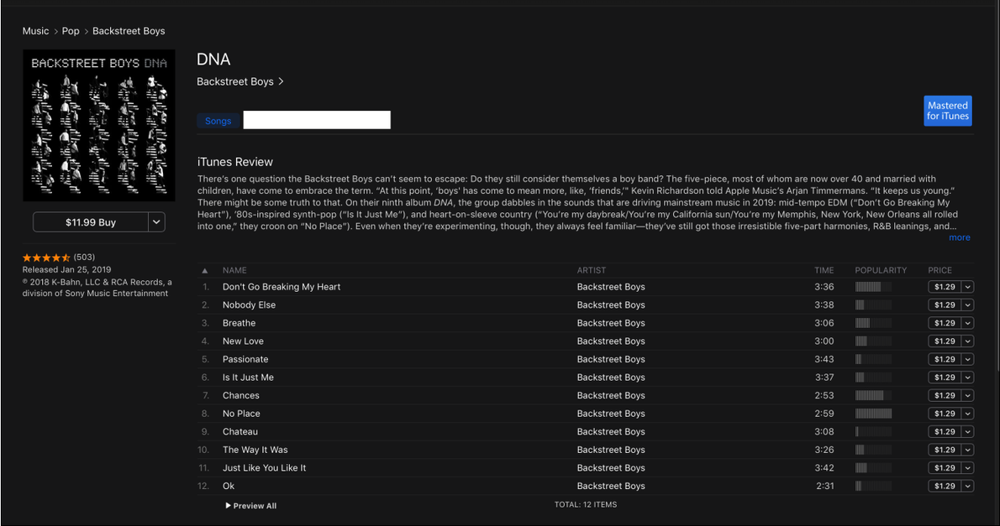

# Music APP API

Simple API for music app

]

## Frameworks - Tools - Libraries

- .NET Core 3.1
- Entity Framework Core
- Automapper
- NLog
- xUnit
- Swagger
- shouldly

## Run

```PowerShell
dotnet restore
dotnet run --project ./MusicApp.Api/MusicApp.Api.csproj
```

## Test

```PowerShell
dotnet test
```
